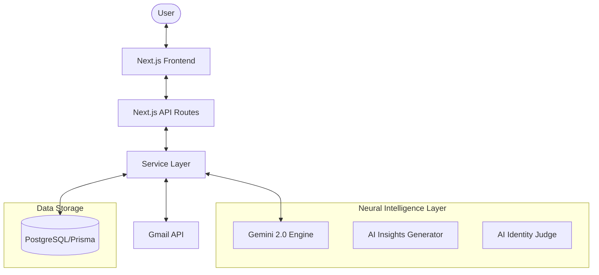
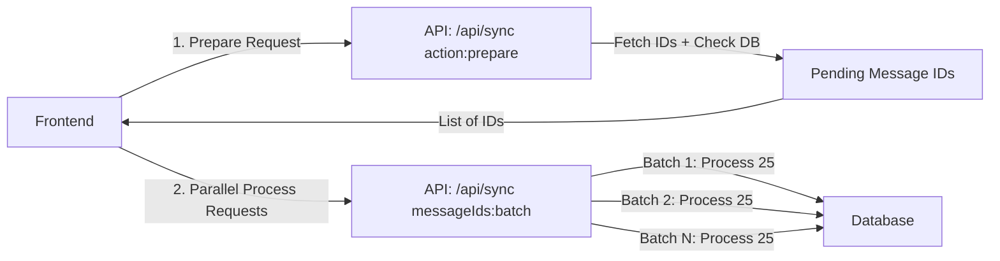
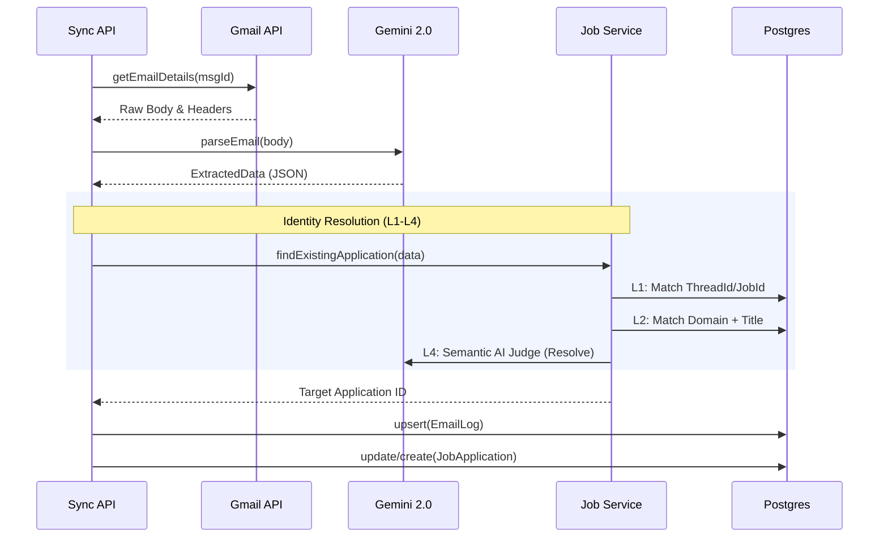

# 🏗️ Architecture Walkthrough

Meridian is built with a focus on **Neural Intelligence** and **Data Integrity**. It transforms unstructured inbox data into a structured career strategy using Next.js and Google Gemini.

## 🗺️ High-Level System Map

## 🔄 Neural Sync Pipeline (High Performance)

The synchronization process uses a client-orchestrated, multi-stage pipeline designed to handle large volumes (up to 365 days) while avoiding Vercel serverless timeouts.

### 1. The Two-Stage Flow

### 2. Deep Processing Logic
When a batch is processed, each email undergoes a multi-layered extraction and validation cycle:

## 🧬 Identity Resolution Layers (The "AI Judge")

Meridian doesn't just list emails; it resolves **Identities**. It uses a hierarchical matching strategy to group fragmented information:

| Layer | Type | Mechanism |
| :--- | :--- | :--- |
| **L1** | **Deterministic** | Matches `Gmail Thread ID` or unique `Job Reference ID`. |
| **L2** | **Domain Filter** | Groups by `companyDomain` (e.g., google.com) and role similarity. |
| **L3** | **Heuristic Retrieval** | Searches for similar company names (e.g., "Google" vs "Google Inc"). |
| **L4** | **Neural Judge** | AI analyzes top 5 candidates to determine if a status update belongs to an existing job. |

## 🛠️ Performance Architecture

### 1. Parallel Batching
By splitting the sync into batches of 25 and running them in parallel from the client, we achieve:
- **Zero Timeouts**: Each request completes well within Vercel's 60s limit.
- **High Throughput**: 100+ emails can be processed in seconds.
- **Progressive UI**: Users see real-time updates for each batch.

### 2. Transaction Integrity (Upsert)
To handle race conditions in parallel requests, the system uses **Atomic Upserts** (`prisma.emailLog.upsert`). This ensures that if the same `gmailId` is processed twice (due to overlap or retry), the database remains consistent.

### 3. Smart Throttling
The frontend detects `429` (Rate Limit) errors from the AI engine or Gmail API and performs exponential backoff to ensure the pipeline remains stable during large-scale historical syncs.

---
*Created with focus on Reliability and Neural Depth.*
