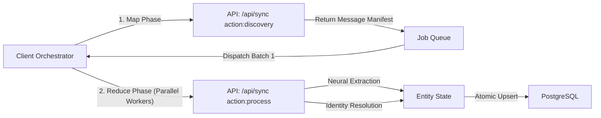
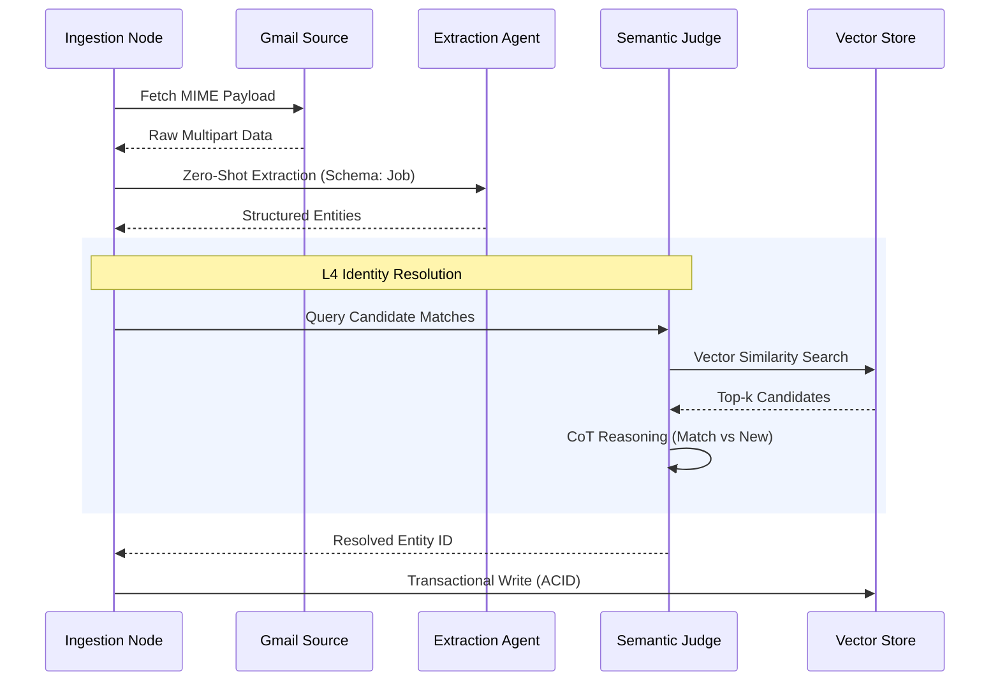

# 🏗️ Architecture Deep Dive: Agentic Systems & Data Mesh

Meridian is architected as a **Neural-First Application**, treating unstructured email data as a stream of events that are processed by a **Multi-Agent System (MAS)**.

## 🗺️ Microservices & Agent Topology

```mermaid
graph TD
    User([User]) <--> Frontend[Next.js Edge Runtime]
    Frontend <--> API[Serverless Functions]
    API <--> Orchestrator[Agent Orchestrator]
    Orchestrator <--> Database[(PostgreSQL Vector DB)]
    Orchestrator <--> GmailAPI[Gmail Data Stream]
    Orchestrator <--> LLM[Gemini 2.0 Flash (Reasoning Core)]
    
    subgraph "Cognitive Layer"
        LLM
        RAG[RAG Knowledge Base]
        Judge[L4 Semantic Judge]
    end
    
    subgraph "Persistence Layer"
        Database
    end
```

## 🔄 Event-Driven Ingestion Mesh

To bypass serverless execution limits (Vercel 60s timeout), Meridian employs a **Client-Side Orchestrator** pattern that manages distributed job queues.

### 1. The Distributed Worker Pattern


### 2. Cognitive Processing Cycle
Each email event triggers a **Chain-of-Thought (CoT)** execution flow:



## 🧬 Semantic Identity Resolution (L4 Neural Judge)

Meridian solves the "Fragmented Data Problem" (e.g., "Google" vs "Alphabet Inc") using a multi-layered resolution strategy culminating in an LLM-based judge.

| Layer | Strategy | Algorithmic Complexity |
| :--- | :--- | :--- |
| **L1** | **Deterministic Hash** | O(1) exact match on `ThreadID` or `MessageID`. |
| **L2** | **Domain Clustering** | O(n) grouping by `senderDomain` normalization. |
| **L3** | **Fuzzy String Match** | Levenshtein distance for company name canonicalization. |
| **L4** | **Semantic Agent** | **LLM-driven Context Analysis** utilizing token-aware comparisons to resolve ambiguous status updates (e.g., "Team Match" email belongs to the "SDE II" application). |

## 🛠️ High-Throughput Distributed Processing

### 1. Client-Side Concurrency Control
We implement a **Semaphore-based Rate Limiter** on the client to manage `maxConcurrency=5` batches. This ensures we stay within Gmail's API quotas (`user.messages.get`) while maximizing throughput (~100 emails/10s).

### 2. Idempotent Write Operations
All database mutations use **idempotent upsert logic**. This guarantees eventual consistency even if network partitions cause a batch to be retried.

### 3. Adaptive Backoff Strategies
The ingestion engine monitors `429 Too Many Requests` signals and automatically applies **Exponential Jitter Backoff**, ensuring system stability under high load.

## 🔐 Zero-Trust Governance

### 1. RBAC & Allowlist Protocol
Meridian enforces a **Data Sovereignty** model where only whitelisted identities can instantiate a session.
- **Middleware Guardrails**: Edge-level JWT verification.
- **Database-Level Policies**: Row-Level Security (RLS) simulation via Prisma middleware.

### 2. Resilient Schema Evolution
To support CI/CD in heterogenous environments, the Auth layer utilizes **Raw SQL Fallbacks**, allowing the system to boot even if the ORM client is de-synchronized during a migration event.

---

## 📊 Analytics & Interactive Pipeline Architecture

### 1. Optimistic State Management (Kanban)
The Pipeline utilizes **Optimistic UI patterns** to provide 60fps interaction:
- **Client Cache**: Local state mutates instantly upon `dragEnd`.
- **Reconciliation**: Server Actions (`updateJobStatus`) sync state in the background.
- **Rollback**: Automatic state reversion upon server validation failure.

### 2. ETL Ingestion Pipeline (Bulk Import)
A specialized **Extract-Transform-Load (ETL)** pipeline for unstructured text:
1.  **Ingest**: Raw text buffer accepts multi-format input.
2.  **Transform**: LLM Agent applies **Few-Shot Styling** to normalize data into the `JobApplication` schema (including `rejectionReason` extraction).
3.  **Load**: Batch transaction writes with deduplication logic.

### 3. Unified View Architecture
The `DashboardClient` uses a **Strategy Pattern** to swap between `JobCardView`, `JobGridView`, and `KanbanBoard` based on a centralized `viewMode` state. This ensures search, filter, and sync logic are shared across all visual representations.

---
*Architected for Scalability, Observability, and Agentic Autonomy.*
