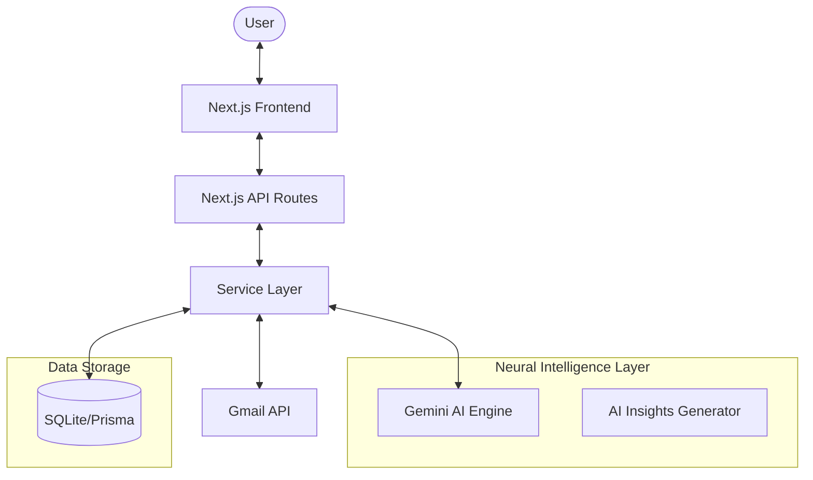
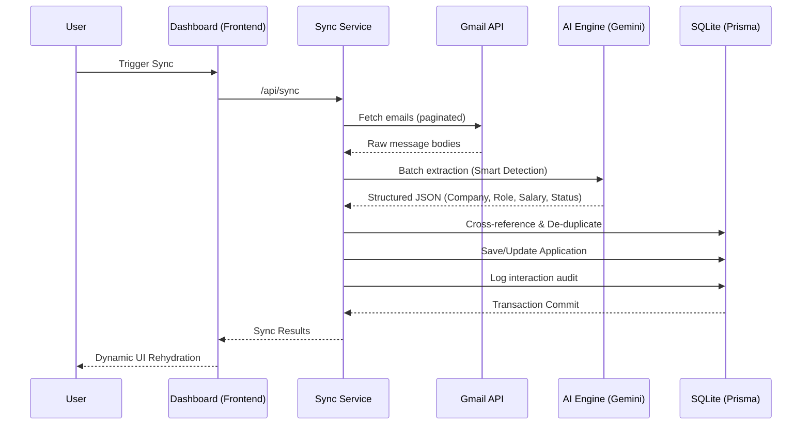

# 🏗️ Architecture Walkthrough

Meridien is built with a focus on **Neural Intelligence** and **Data Integrity**. It transforms unstructured inbox data into a structured career strategy using Next.js and Google Gemini.

## 🗺️ High-Level System Map

## 🔄 Neural Sync Workflow

The synchronization process is the heart of the application. It's an multi-stage pipeline designed for accuracy and speed.

## 🧬 Core Architecture Principles

### 1. Neural Extraction (Service Layer)
Located in `src/services/ai/`, this layer handles communication with Google Gemini. It uses strictly typed JSON schemas to ensure that AI outputs are predictable and ready for the frontend.

### 2. Smart Threading & De-duplication
Meridian doesn't just list emails; it resolves **Identities**. The consolidation logic (found in `MaintenanceControls.tsx` and related API routes) uses AI matching to merge "Google" and "Google Inc." into a single application entity while preserving the full email history.

### 3. Progressive Intelligence
The `AIInsightsPanel` utilizes heuristics and AI feedback to surface:
- **Urgent Deadlines**: Offer expirations within 72 hours.
- **Interview Readiness**: Syncs with calendar dates found in emails.
- **Ghosting Detection**: Identifies applications with no movement for >14 days.

### 4. Direct Feedback Loop
When a user clicks "Trash" or "Improve AI detection", the system logs a `UserFeedback` entry. These entries are used as **contextual hints** for future deep-rescan operations, allowing the system to learn from its mistakes.

## 🛠️ Tech Stack Nuances
- **Prisma + SQLite**: Chosen for zero-config local development and blazing-fast local queries.
- **Framer Motion**: Used for the "Neural" feel of the UI, providing fluid transitions for high-priority alerts.
- **NextAuth + Server Actions**: Secure Google OAuth flow handled via modern Server Actions (`src/lib/actions.ts`) to ensure stable authentication transitions across both client and server components.

<!-- CI/CD Test Commit -->
