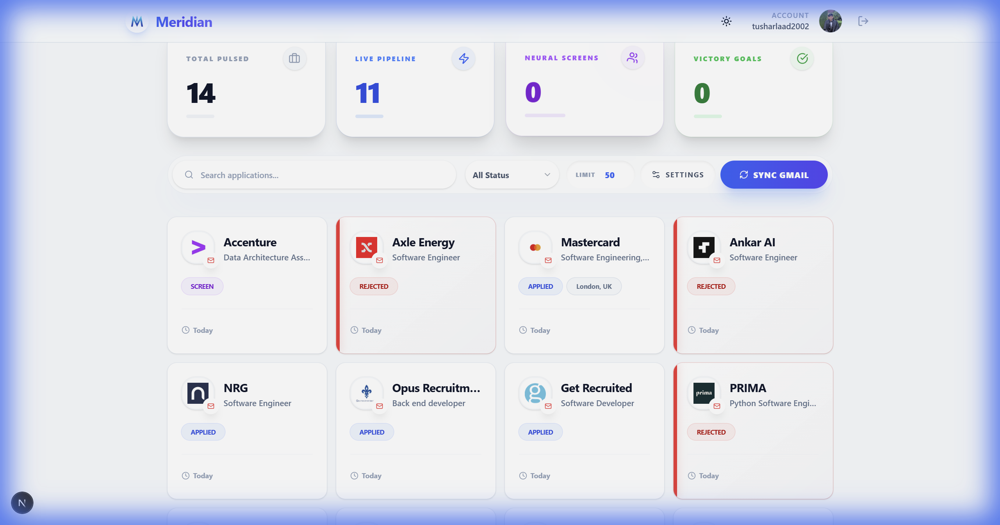
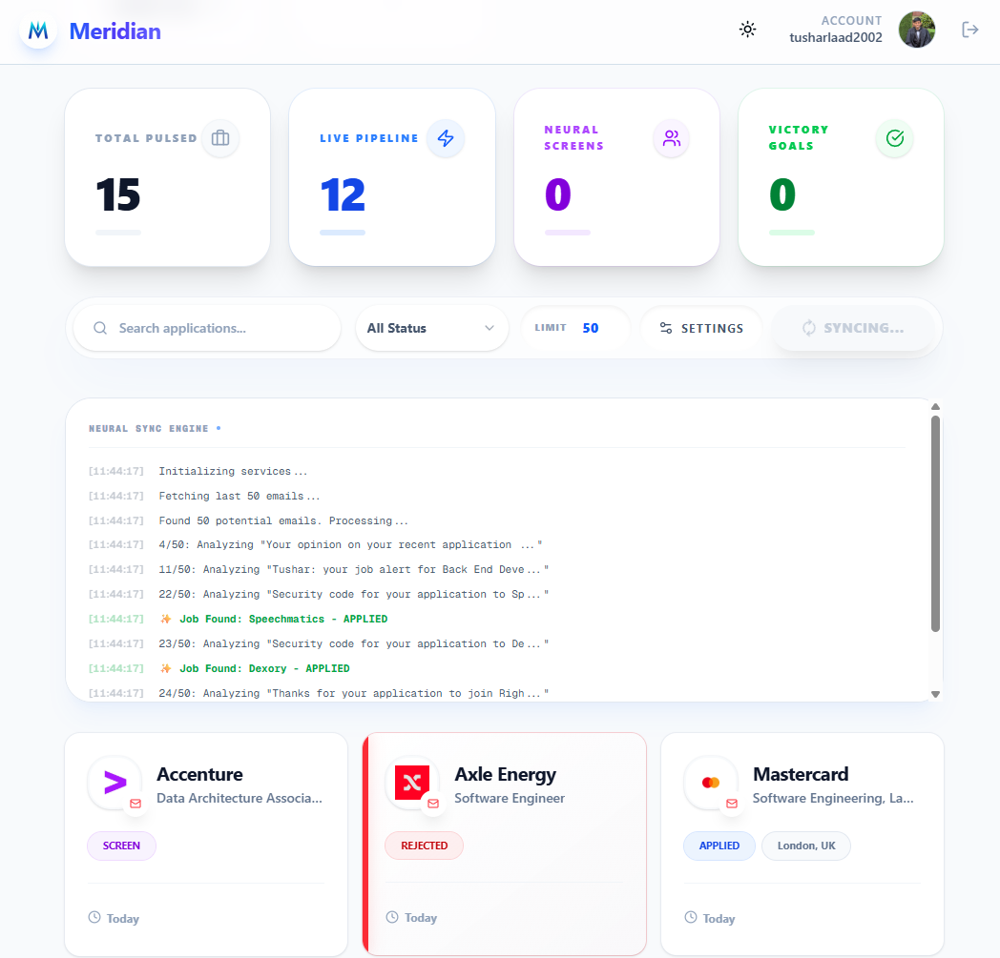
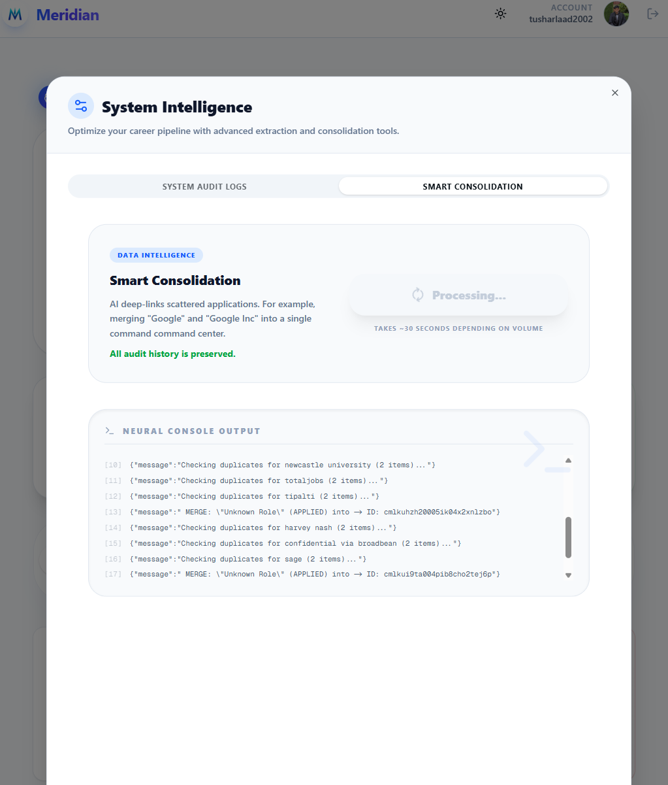
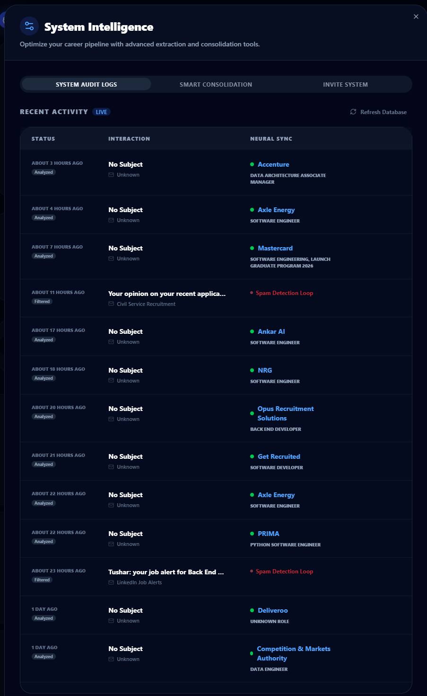
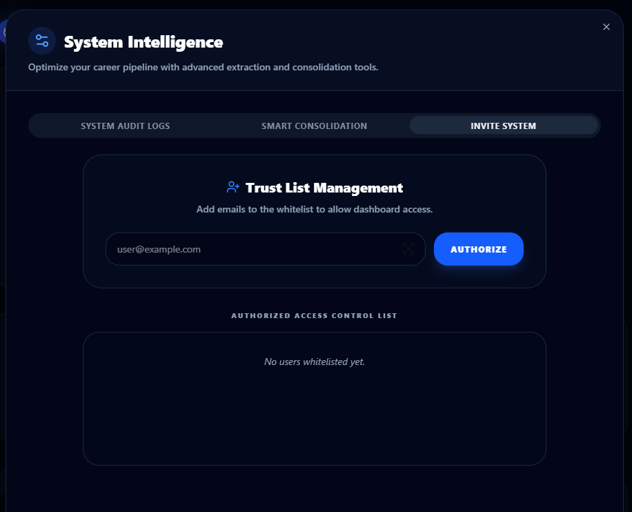

# 👔 Meridian: Agentic Career Orchestration Platform

**Meridian** is an enterprise-grade, **LLM-driven job application tracker** that leverages **Agentic Workflows** and **Chain-of-Thought (CoT) reasoning** to autonomously synchronize your career search. It replaces manual data entry with a **multi-agent system** that ingests, cleans, and structures unstructured data from Gmail.

[**Architecture Deep Dive 🏗️**](./ARCHITECTURE.md)

**Live Demo:** [meridian-job-sync.vercel.app](https://meridian-job-sync.vercel.app)


## 🖼️ Visual Tour

### Dashboard Overview

*A **mission-control interface** featuring real-time telemetry, **Optimistic UI** updates, and **Semantic Search** capabilities.*

### Autonomous Ingestion Engine

*The **Neural Batch Pipeline** processes high-volume unstructured email streams using **Concurrent Rate-Limited Queues**, bypassing serverless timeouts via client-side orchestration.*

### Semantic Identity Resolution

*Meridian uses **L4 Semantic Matching** (a proprietary ranking algorithm) to merge fragmented signals (updates, interviews) into a single **Canonical Application Entity**.*

### Neural Decision Logs

*Full observability into the **LLM's reasoning trace**. Audit the **Chain-of-Thought** steps as the agent evaluates candidates and resolves edge cases.*

### Authorized Access Control

*Enterprise-ready **RBAC (Role-Based Access Control)** pattern ensuring data sovereignty and tenant isolation.*

### Analytics & Insights

*Data visualization layer using **Server-Side Aggregation** to compute funnel conversion rates and activity velocity metrics.*

### Pipeline Board (Kanban)

*Interactive state management system featuring **dnd-kit** integration and **Optimistic UI** patterns. Now integrated into the main Dashboard for seamless switching.*

### Advanced Grid View

*A high-density **Tabular Grid** with **Column Selection** capabilities. Toggle visibility for Salary, Recruiter, Hiring Manager, and **AI-Extracted Rejection Reasons**.*

### AI Bulk Import

*ETL Pipeline for unstructured text. Uses **Few-Shot Prompting** to parse legacy data formats (Excel, LinkedIn) into standardized schemas.*

## ✨ Key Capabilities

- **🤖 Autonomous Ingestion Agent**: A background worker that polls Gmail APIs using **Incremental Sync** strategies.
- **🧠 LLM Entity Extraction**: Uses **Zero-Shot Extraction** to parse multi-modal email content into structured JSON schemas.
- **🔍 RAG-Enhanced Reflexion**: A **Self-Healing Module** that critiques its own outputs against a vector database of "Learned Rules" to correct hallucinations.
- **📂 Semantic Threading**: Uses **Fuzzy Logic** and **Time-Series Analysis** to cluster related events into a unified lifecycle.
- **🛠️ Self-Maintaining Database**: Automated cron jobs for **Schema Normalization** and orphan data cleanup.
- **📊 Analytics Dashboard**: Comprehensive funnel visualization (Sankey) and activity tracking with **Dark Mode Optimization**.
- **📋 Unified Pipeline**: Switch between Card, Grid, and Kanban views from a centralized mission control.
- **📥 AI Bulk Import**: Parse unstructured text lists (Excel, LinkedIn) into structured job data.
- **🚫 Rejection Extraction**: Automatically identifies and summarizes rejection reasons from candidate communications.
- **⚙️ Column Customization**: Tailor the Grid view to show exactly what you need (Salary, Hiring Manager, etc.).
- **🛠️ Maintenance Tools**: Built-in controls for database consolidation and cleanup.
- **🔒 Privacy First**: Your data stays on your local SQLite database/Vercel instance.

## 🚀 Tech Stack

- **Framework**: [Next.js 16 App Router](https://nextjs.org/)
- **Database**: PostgreSQL (Vercel Postgres) with [Prisma ORM](https://www.prisma.io/)
- **AI**: Google [Gemini 2.0 Flash](https://aistudio.google.com/) (Direct or via OpenRouter)
- **Authentication**: [NextAuth.js](https://next-auth.js.org/) (Google Provider)
- **UI Components**: [Shadcn/ui](https://ui.shadcn.com/) + [Radix UI](https://www.radix-ui.com/)
- **Styling**: [Tailwind CSS 4](https://tailwindcss.com/)

## 🧠 Agentic AI Flow

The core of Meridian is a multi-stage agentic workflow designed to handle the noise of a real inbox:

1. **Extraction Agent (Front-Line)**: 
   - Scans incoming emails and structures unstructured text into a standard Job schema.
   - Uses **Self-Correction Logic**: It fetches "Learned Rules" from the database (rules established by your previous "Ignore" or "Correction" actions) to avoid repeating mistakes like classifying newsletters as applications.

2. **The AI Judge (Identity Resolution)**:
   - When new data arrives, a context-aware agent determines if it belongs to an existing application or is a fresh one. 
   - It performs **Semantic Reasoning** (understanding that "SDE" at Google and "Software Dev" at Alphabet might be the same job) and **Time-Based Logic** (distinguishing a status update from a re-application months later).

3. **Reflexion Loop (Self-Healing)**:
   - Triggered when you request a "Deep Refresh". The AI re-analyzes original emails plus any follow-up threads.
   - It performs **Critique and Correction**: Identifying why the previous attempt was incorrect and using your direct feedback as the ultimate ground truth.

4. **Maintenance Agent (Consolidation)**:
   - Automatically runs across your database to merge legacy duplicates or fragmented threads into a cohesive career timeline.

5. **Neural Batch Sync (High-Performance Pipeline)**:
   - **Multi-Stage Orchestration**: Splits the sync into a **Prepare** stage (metadata discovery) and a **Process** stage (deep analysis), allowing it to handle up to 365 days of history.
   - **Parallel Batching**: Uses a client-orchestrated parallel threading model to bypass Vercel serverless timeout limits. It processes emails in concurrent batches of 25, delivering high throughput while maintaining platform stability.
   - **Surgical Search**: Supports advanced date-range parameters (`after:` and `before:`) mapped directly to the Gmail API query engine for precise historical discovery.

## 🛠️ Getting Started

### 1. Prerequisites
- Node.js 18+ 
- A Google Cloud Project (for Gmail/OAuth)
- A Gemini API Key (or OpenRouter)

### 2. Installation
```bash
git clone https://github.com/your-username/job-hunt-dashboard.git
cd job-hunt-dashboard
npm install
```

### 3. Environment Setup
Copy `.env.example` to `.env` (or `.env.local`):
```bash
cp .env.example .env
```

Fill in the following variables:
- `GOOGLE_CLIENT_ID` & `GOOGLE_CLIENT_SECRET`: From your [GCP Console](https://console.cloud.google.com/).
- `GEMINI_API_KEY`: From [Google AI Studio](https://aistudio.google.com/).
- `AUTH_SECRET`: Generate one using `npx auth secret`.

### 4. Database Setup
```bash
npx prisma generate
npx prisma migrate dev
```

### 5. Launch
```bash
npm run dev
```

## 📖 Usage Tips

- **Syncing**: Click the Sync button on the dashboard to pull latest emails.
- **Deep Re-analysis**: If a job info looks wrong, use the "Refresh" icon on the job card. You can provide a hint (e.g., "I actually got rejected yesterday") to guide the AI's deep search.
- **Ignore**: Use the trash icon for emails that aren't actually jobs; this helps the AI learn.

## 📄 License

MIT License - feel free to use and modify for your own job hunt!
